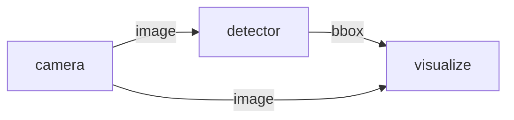
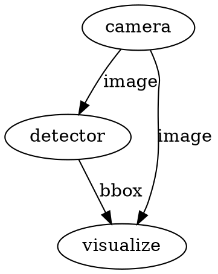
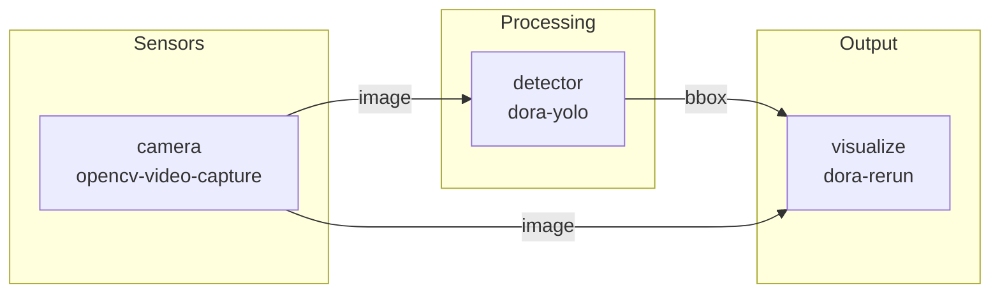
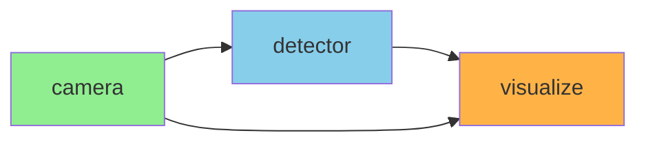
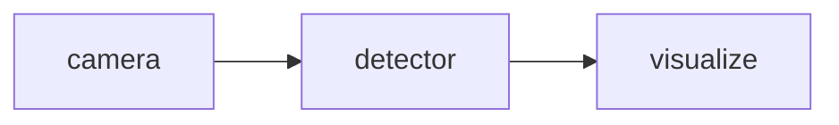
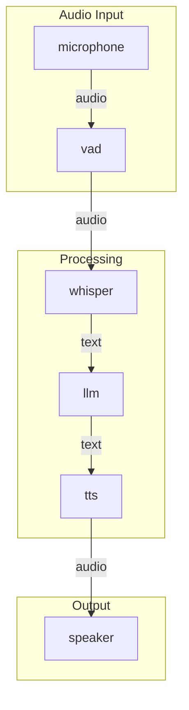

# /visualize Command

Generate visual representation of a dataflow.

## Usage

```
/visualize [<dataflow-file>] [--format <format>] [--output <file>]
```

## Arguments

| Argument | Description | Default |
|----------|-------------|---------|
| `<dataflow-file>` | Dataflow YAML path | ./dataflow.yml |
| `--format` | Output format | mermaid |
| `--output` | Save to file | - |

## Formats

### mermaid (default)
Mermaid diagram syntax for markdown/web:



### ascii
ASCII art for terminal:

```
┌────────┐     ┌──────────┐     ┌───────────┐
│ camera │────▶│ detector │────▶│ visualize │
└────────┘     └──────────┘     └───────────┘
      │                               ▲
      └───────────────────────────────┘
```

### dot
Graphviz DOT format:



## Examples

### Basic visualization

```
/visualize
```

Output (Mermaid):


### Save to file

```
/visualize dataflow.yml --output graph.md
```

### Graphviz PNG

```
/visualize --format dot --output graph.dot
dot -Tpng graph.dot -o graph.png
```

## Node Information

The visualization includes:
- Node ID
- Node type/path
- Input connections with labels
- Output ports
- Timer inputs (shown as dashed lines)

## Styling

### Mermaid styles by node type:

| Type | Color |
|------|-------|
| Sensor | Green |
| Processing | Blue |
| Output | Orange |
| Robot | Red |

### Example styled output:



## Integration

### Use with dora CLI

```bash
# Built-in visualization
dora graph dataflow.yml

# Open in browser
dora graph dataflow.yml --open
```

### Markdown embedding

Include in documentation:
````markdown
## Architecture


````

## Complex Example

For a speech-to-speech robot:



## Troubleshooting

| Issue | Solution |
|-------|----------|
| Invalid YAML | Fix syntax errors first |
| Missing connections | Check node input sources |
| Circular dependency | Redesign data flow |
